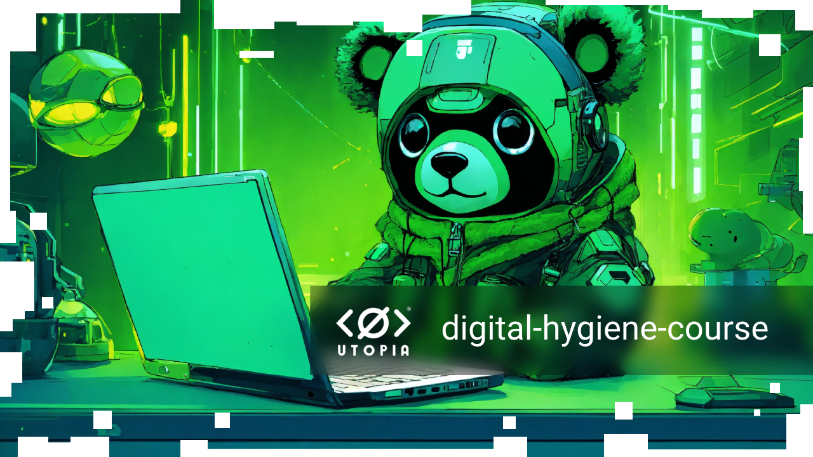

# digital-hygiene-course

Mini-course on digital hygiene for users to give people tips on how to critically evaluate information on the Internet.

And there is one tool that allows you to find answers to questions, solve problems and find quality information - Utopia AI.

---

